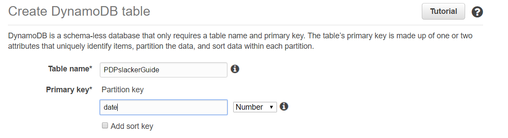
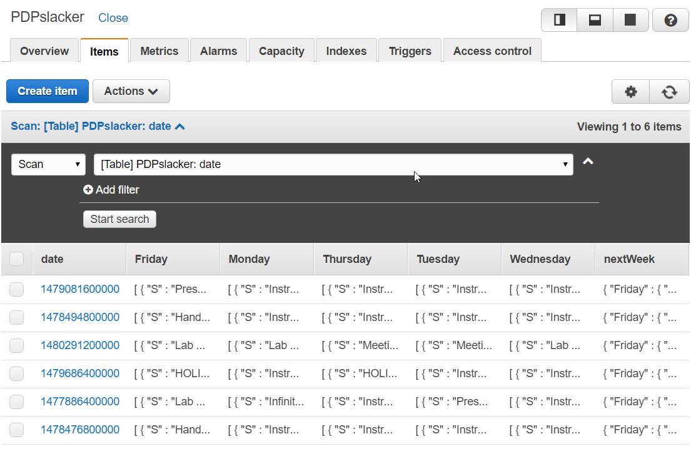
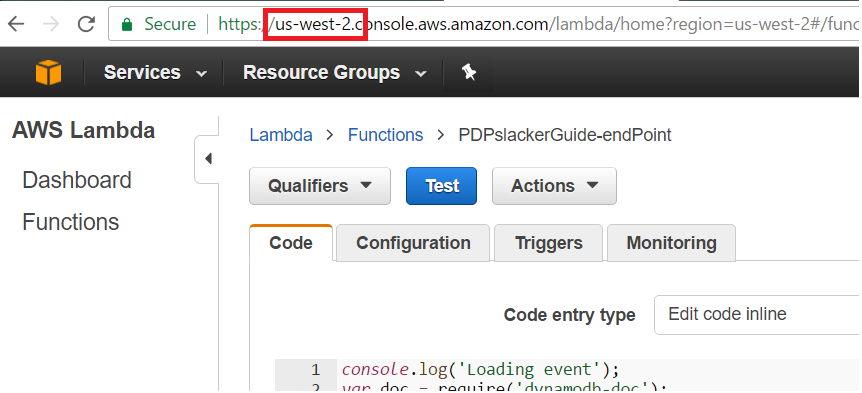
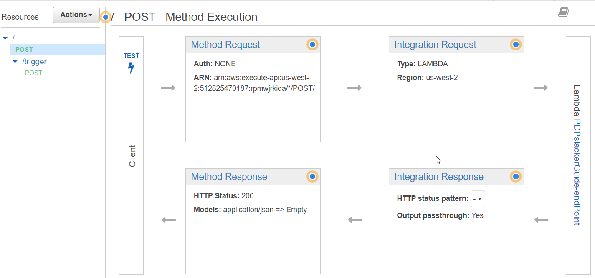
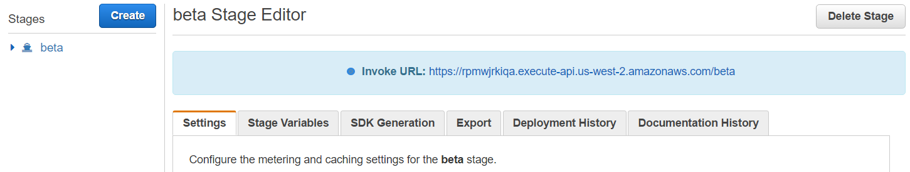
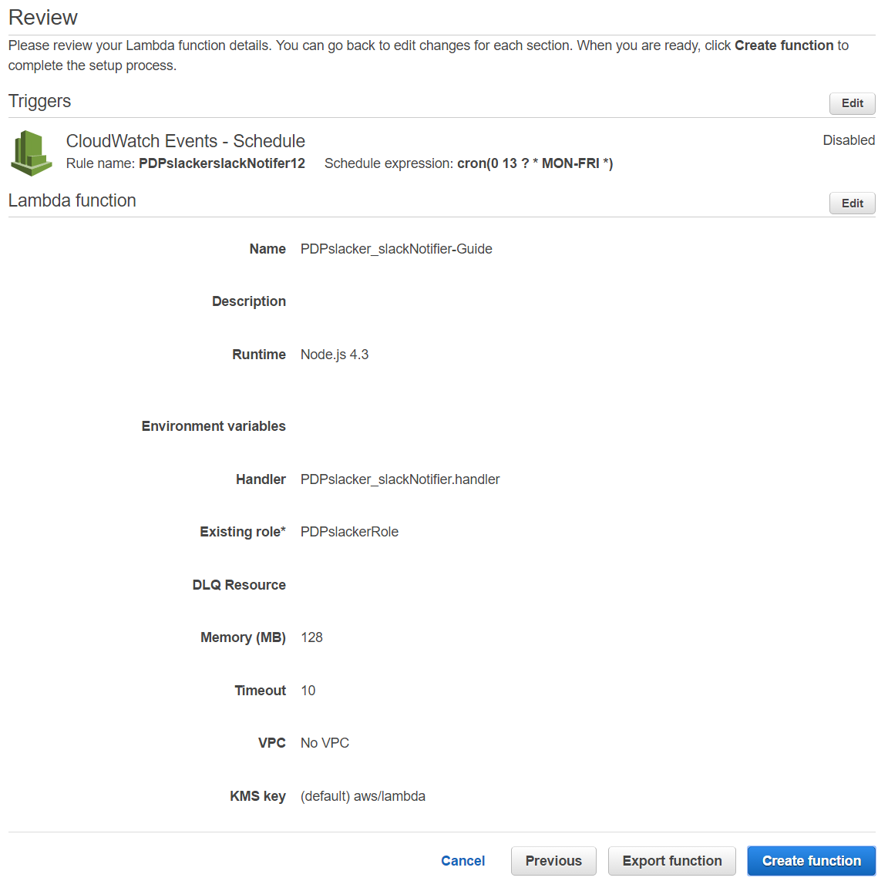

# PDPslacker

## What even is?

Converts the PDP weekly schedule document into an aesthetically pleasing daily slack message so that everyone knows what's meant to happen that day.

It looks like this: 

It semi-automates (with the goal of automating) the process of informing PDP members of their daily tasks by interfacing with a slack channel.
By taking a user provided word document that meets a particular formatting, parsing that into html using mammoth and then pulling out relevant information.
Information is stored in an AWS dynamodb instance and fetched each day by a lambda function that places a nicely formatted snippet of the current day's tasks in a slack channel. 

Currently this repo only supports a manual setup, and that's outlined in the installations section of this readme. 

**NOTE** While everything in this guide should fall under AWS's free tier you _may_ be charged a small amount. 
But that's okay because if you're reading this you're probably Dynatrace now! _insert gif of dollar notes falling here_

## Future Features

- Make this a single step installation (if at all possible) using the serverless framework. 
Anybody is free to submit pull requests to this end, and it would be awesome if you could. 
All current progress towards this end has been made in the `sls` branch of this repo and mainly comprises of a `serverless.yaml` file
- Web page gives user feedback when the parsing and upload succeeds or fails. There is only console output at the moment.
- Automatic fetching of new documents from a sharepoint folder. 
This would remove human interaction from the system and make it fully automated! This is the end goal. 

## Repo Structure Explanation

There are 2 folders: `/web` and `/lambda`. 

Everything in `/web` is for a website created by the [`/index.html`](./index.html) file. 
It's barebones and a pull request could be used to make it better, so feel free to focus there. 

Everything in `/lambda` is for use by AWS's lambda system and you'll find the walk through on how to use these files later on in this readme.

## Installation/setup

#### Preinstall

To complete this project's install there are a few things that you'll need to have installed on your local computer. 
- git
- nodejs (and npm)
- AWS account
- something to make a .zip file from a folder

This application uses AWS's lambda offering with nodejs code, so if you're not already famaliar with these technologies then this is the perfect time to learn about them! :D

Decide how you want to host the web part of this repo. The easiest method and the method I set this repo up to use is github pages. 
If you didn't already know, github can host parts of your repo as a website, allowing you to host all of your documentation or examples and the like with minimal effort. 
Alternatively, you can host this repo's web portion using any other website hosting method you know such as on your own webserver or a simple free tier AWS instance etc. 
You just need to have this repo hosted somewhere so that people can visit [`/index.html`](./index.html). 
As an example, this repo is currently hosting using github pages at http://cavejay.github.io/PDPslacker.

If you've decided to use github pages as your hosting system then you'll want to fork this repo. Make sure you've signed into github and then click the fork button in the top right region of the repo's home page (where you're probably reading this guide). 
Navigate to your fork of the repo and open up it's settings. 
On the first page of settings you should be able to scroll down and see the "GitHub-pages" options. 
Make sure the source is the Master branch and that you're forcing https, apply the settings and check that the site is visitable and your hosting is all setup. 

The following is what my GitHub pages settings look like.


#### Installation

1. Clone this repo to your computer using `git clone https://cavejay.github.com/PDPslacker` (if you forked this repo clone that instead and you're going to be making changes to the web site portion)

2. Go to `https://<youslackteam>.slack.com/apps/build/custom-integration` and create an incoming webhook for your slack team. 
You should end up with a page that looks like this:  
From here you will have to select the channel that you want the bot to post to and click the "Add incoming Webhooks Integration" button. 
The page will then open out with information about incoming webhooks and all configuration options. 
You should read all of this so you have an idea of what's going on.

3. You'll need to copy the webhook URL as that's what we'll be using later. 
Name the integration PDPslacker (or something else if you like), provide a short description on what the integration does and use the [dynatrace icon](./dynatraceIcon.png) that's included in this repo.
You've now set up the slack end of the integration. 

4. We're using a combination of AWS's lambda and API Gateway services for the 'backend' of our integration. 
Head to [https://aws.amazon.com/](https://aws.amazon.com/) and sign in to your AWS account.

5. Once logged in you'll need to head to the API Gateway service through the services menu. 
While Lambda is what we're using to do all the thinking, in order to create an API of sorts we're using API Gateway as an intermediary. 
The Services menu is kinda confusing, so here's a picture of where to find it. 
API Gateway descretises an API into HTTP methods like GET, PUT and POST. 
When someone uploads a valid document to the website part of our application it will post the extracted data to an endpoint of our API where we'll capture it and pass it to the appropriate lambda function.

6. Create a new API, naming it something sensible like "PDPslacker" and give it a description if you want. 
Once it's all setup you should end up with an empty screen that looks something like this:


7. Create a new POST method on the root of the API using the actions drop down menu. 
Once that's done we're going to create a lambda function that links to this API.

8. In a new tab, open the AWS dynamodb services page.
You can find it in the massive services list under the Database heading. 
We're going to create a new DynamoDB database to store the information so we don't have to keep processing it. 
Call the database something like "PDPslacker". It's not that important but it's good policy.
Call the primary key "date" and **make it a number** using the dropdown.  
Finally, set the read and write capacity units to 1 as this database will not be used heavily at all.

9. After a couple of **weeks** your DynamoDB should start to look a bit like this: 

10. We need to make a role that will allow our lambda functions to access the DynamodDB that we just created. 
So go to the services menu once again and choose IAM under "Security, Identity & Compliance".

11. From the Roles option on the left create a new Role called PDPslackerRole.
The role type will be AWS Lambda and you'll need to Attach the Poilcy named "AmazonDynamoDBFullAccess" to ensure we can write to our database. 
We should now be ready to create our Lambda functions.

12. In a new tab, open the AWS lambda services page. 
You can find it in the massive services list under the Compute heading. 
Once it's open create a new lambda function using the "Blank function" blueprint.

13. On the next page you will need to configure the triggers for your lambda function. 
In this case, our trigger will be the API Gateway that we started setting up just before, so select API Gateway and then our API from the corresponding dropdown. 
Down worry too much about the deployment stage but make sure that you set the security to `open` so that we can access it straight away.
If you haven't done any reading on what a lambda function is, it's a piece of code that is run when ever a trigger is fulfilled. 
It takes the input, does the processing and can produce an output. 
All of this is stateless and we only have to pay for the few milliseconds that the function is running and only when it's triggered. 
It's a cost effective way to run an event driven application such as our Slack integration.

14. Now it's time to name and write the lambda actual function. 
I recommend that you name it PDPslacker-awsEndpoint and follow that naming convention for the rest of this guide too, but do as you like. 
Copy the contents of the [lambda/PDPslacker_awsEndpoint.js](lambda/PDPslacker_awsEndpoint.js) file into the text box for code and have a brief read through it.
You will need to make ensure that the `tableName` variable on line 11 correctly refers to the table you made earlier!
All this piece does is collect the data sent by the website and add it to the database. 

15. Below where you copied the code in the configuration for "Lambda function handler and role" Make sure the handler is index.handler, the Role is "Choose an existing role" and then choose the role that we created just before from the drop down option for Existing Role. 
You could also take this opportunity to tweak the RAM or timeout time assigned to this function but as it does so little it's kinda pointless.
Once done click next and then create the function.

16. Take note of what region your lambda instances are running in, as we need to select them based on this. 
You can tell by checking the first part of the URL for your lambda service page. Once you know which region they're running in then go back to your API Gateway setup page.
 

17. Once at your API settings select the root POST method. 
Using the lambda integration type select the correct region from the drop down and write the name of the lambda function we just made. 
Once you start typing a drop down selection should provide autocompletion options. 
Save this page and it should update to show something that looks more like this: 

18. The final step to publishing this part of the API is to Deploy it. 
Use the Actions drop down menu to select "Deploy API". 
You'll need to make a stage to deploy it too, it can be called what ever you like but test or beta would work well in this case.
Add descriptions as you wish and then deploy it! :D

19. Stages allow us to have different versions of the API live at the same time. 
We might use the prod stage for normal use but continue development on the beta stage. 
We're only going to use a single stage for this project and now that you've deployed the API you should be on the stage UI with an invoke URL that we can use to test the API we just made.
It should look like this: 

20. You should now be able to POST specifically formatted data to the root of your API and have it appear in your database.
Use a program that will allow you to send a specific POST request to our URL. 
The command line tool curl can do this but I prefer the [Chrome application Postman](https://chrome.google.com/webstore/detail/postman/fhbjgbiflinjbdggehcddcbncdddomop?utm_source=chrome-ntp-icon) for it's ease of use. 

21. Using your choice of tool you should send a POST request with the `Content-Type` request header set to `application/json` and the following snippet as the request body to the API URL that you saved earlier.
    ```json
    {  
        "nextWeek": {
            "Monday": [
                "Codecademy – Learn Java",
                "Instructor Led – Dynatrace Community Portal",
                "Instructor Led – License Management Overview",
                "Instructor Led – Creating a Helpdesk Ticket",
                "Instructor Led – Presentation Training – Point of View Whiteboard"
            ],
            "Tuesday": [
                "Codecademy – PHP",
                "Instructor Led – Anatomy of an IT Organization"
            ],
            "Wednesday": [
                "Meet Shawn Washburn – VP Enterprise Services",
                "Safari – Learning ASP .Net MVC",
                "Instructor Led – Virtualization Overview"
            ],
            "Thursday": [
                "Instructor Led – Guardian Best Practices – The Makeup of a Guardian",
                "Codecademy & Safari – Finish eLearning",
                "Test – Anatomy of an IT Organization",
                "Self-Study – POV Whiteboard"
            ],
            "Friday": [
                "Presentation – Point of View Whiteboard",
                "Dynatrace University – Application Monitoring Pre-Requisite eLearning"
            ]
        },
        "tip": "Tip of the Hat – Nomination taken weekly from teammates that go above and beyond the call of duty.",
        "date": 1483833600000,
        "Monday": [
            "Arrival, Tour, and First Day Paperwork",
            "Introduction to PDP with Cale",
            "Move into workspace, receive laptop, tools of the trade",
            "One-page writing assignment – How will you apply 212° in your life? – Due Friday January 13th",
            "DiSC Consulting pre-class work – Due today"
        ],
        "Tuesday": [
            "Dynatrace University – APM Associate Overview – 30 assets",
            "Handout APM Associate Blueprint",
            "Dynatrace University – The Dynatrace Point of View"
        ],
        "Wednesday": [
            "Dynatrace University – APM Associate Certification Self-Study",
            "Dynatrace University – Dynatrace Overview – Video "
        ],
        "Thursday": [
            "Dynatrace University – APM Associate Certification Self-Study",
            "DXS Enablement Services e-learning",
            "SharePoint – Tales from the Trenches",
            "Test – APM Associate Certification Exam"
        ],
        "Friday": [
            "Instructor Led – DiSC Consulting w/ Sue Jayroe",
            "SharePoint – Tales from the Trenches"
        ]
    }
    ```

22. If we've done everything correctly to this point, then you should recieve the response `SUCCESS` and there should be an entry in your DynamoDB table.
If there isn't have a glance over the guide again and check each point. 
Remember that you've needed to make some small changes to the code that we've used, make sure that you actually made and saved them.
    It should be noted that running this request multiple times will never result in more than the single DB entry. This is due to our use of the date variable as an identifier. There will only ever been 1 entry for each day and each of those entries can be updated by running the request again with appropriate updated data.

23. Now that we have the ability to recieve data we're going to alter the website part of this project to send it. As I mentioned near the beginning of this document the way you host this isn't important, just make the following changes to the files. 

24. Edit the [main.js](web/js/main.js) file so that the url on line 47 is the same as the one we were just testing. 
Push the change to your site, either by commiting the change to your fork of the repository or by updating the file of your site. 
You should now be able to click and drag a PDP Team Meeting Document into the website and see it appear in your DynamoDB table! 
The same no-dupilcate rule applies here as well. 
To debug check the console of the website for any network or parsing errors. 
You should see the `SUCCESS` response you saw earlier here too.

25. The final section of this guide relates to the Lambda function that brings everything together, by running on a schedule, pulling from the database and publishing to your slack team. 
Start by using your terminal or command prompt to access the [lambda/slackNotifier](lambda/slackNotifier) directory of this repo on your local computer.

26. We need to package this lambda function as a .zip file as it uses a 3rd party module called "request" to interact with the slackhook URL. To download the module you'll need to run `npm install .` in the [`slackNotifier`](lambda/slackNotifier) directory. npm will go throught the process of bringing it locally and when it's returned you to the prompt you should have a new folder called 'node_modules'.

27. Open up the [PDPslacker_slackNotifier.js](lambda/slackNotifier/PDPslacker_slackNotifier.js) file and edit the 2 variables on lines 7 & 8 so that they point to the correct URL and dynamoDB.

28. Using which ever means you're comfortable with, put everything in the slackNotifier folder into a .zip archive so we can upload it as a lambda function. When finished the .zip archive should have 1 folder and 2 files inside: a `node_modules` folder, a `PDPslacker_slackNotifier.js` file and a `package.json` file.

29. Create a new lambda function thats based on the blank blueprint.
This particular Lambda function will be triggered on a schedule and so needs to use the `CloudWatch Events - Schedule` trigger. 
Make a new rule with the name `PDPslackerScheduleRule`, give it a description if you like and use `cron(0 13 ? * MON-FRI *)` as the schedule expression.
Don't enable the trigger yet.

30. Name the function `PDPslacker_slackNotifier` give it a description if you like and make sure the run time is `Node.js 4.3`.
Where it says "Code entry type" you'll need to select `Upload a .ZIP file` and upload the .zip archive that we made in step 27.

31. The Handler field should say `PDPslacker_slackNotifier.handler` and the Role should be the role you made earlier. 
At this point you should probably also up the Timeout time to something closer to 10 seconds. 
Your review screen should look like this: 

32. That's it! Upload this week's team document and you can either wait for 8am or test it using the bright blue "Test" button on the lambda function's page. 
You'll know if it's successful because it will post to your slack team.

#### Bonus Task!
This bonus task is for if you want a slash command in slack to tell you the day's tasks. It appears invisibly and where ever you are currently which means it can come in handy for when #general has been super busy that day and you don't feel like scrolling.

1. Create a new Resource in your API Gateway named 'trigger' (it should have a resource path of /trigger) and then create another POST method under that too. 

## Debugging (because all useful software has bugs)

1. Point and laugh at your computer. Even if forced it might make you feel better.


