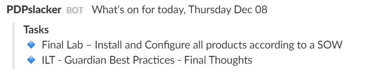
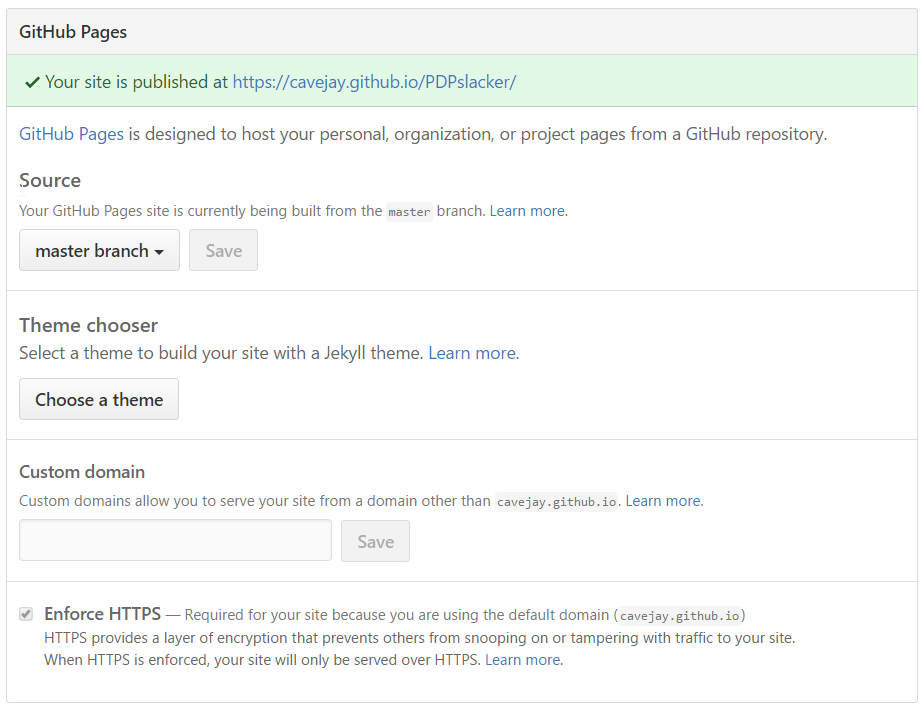
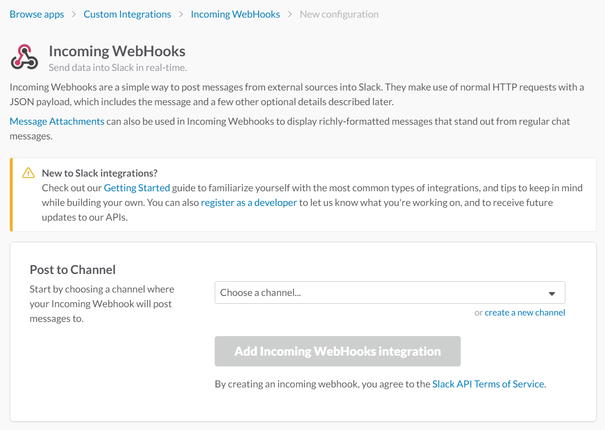
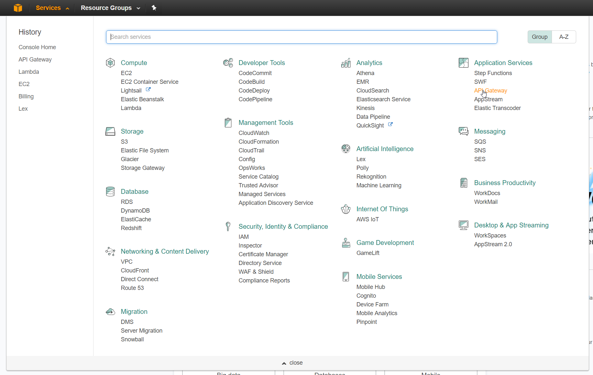
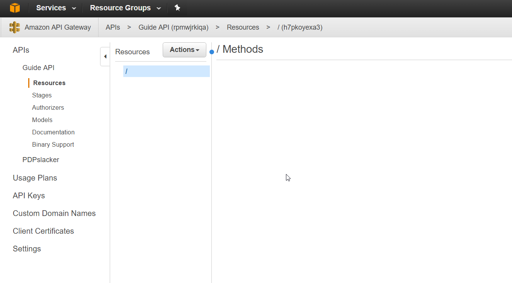

# PDPslacker

## What even is?

Converts the PDP weekly schedule document into an aesthetically pleasing daily slack message so that everyone knows what's meant to happen that day.

It looks like this: 

It semi-automates (with the goal of automating) the process of informing PDP members of their daily tasks by interfacing with a slack channel. 
By taking a user provided word document that meets a particular formatting, parsing that into html using mammoth and then pulling out relevant information.
Information is stored in an AWS dynamodb instance and fetched each day by a lambda function that places a nicely formatted snippet of the current day's tasks in a slack channel. 

Currently this repo only supports a manual setup, and that's outlined in the installations section of this readme. 

## Future Features

- Make this a single step installation (if at all possible) using the serverless framework. Anybody is free to submit pull requests to this end, and it would be awesome if you could. All current progress towards this end has been made in the `sls` branch of this repo and mainly comprises of a `serverless.yaml` file
- Web page gives user feedback when the parsing and upload succeeds or fails. There is only console output at the moment.
- Automatic fetching of new documents from a sharepoint folder. This would remove human interaction from the system and make it fully automated! This is the end goal. 

## Repo Structure Explanation

There are 2 folders: `/web` and `/lambda`. 

Everything in `/web` is for a website created by the [`/index.html`](./index.html) file. It's barebones and a pull request could be used to make it better, so feel free to focus there. 

Everything in `/lambda` is for use by AWS's lambda system and you'll find the walk through on how to use these files later on in this readme.

## Installation/setup

#### Preinstall

To complete this project's install there are a few things that you'll need to have installed on your local computer. 
- git
- nodejs (and npm)
- AWS account
- something to make a .zip file from a folder

This application uses AWS's lambda offering with nodejs code, so if you're not already famaliar with these technologies then this is the perfect time to learn about them! :D

Decide how you want to host the web part of this repo. The easiest method and the method I set this repo up to use is github pages. If you didn't already know, github can host parts of your repo as a website, allowing you to host all of your documentation or examples and the like with minimal effort. Alternatively, you can host this repo's web portion using any other website hosting method you know such as on your own webserver or a simple free tier AWS instance etc. You just need to have this repo hosted somewhere so that people can visit [`/index.html`](./index.html). As an example, this repo is currently hosting using github pages at http://cavejay.github.io/PDPslacker.

If you've decided to use github pages as your hosting system then you'll want to fork this repo. Make sure you've signed into github and then click the fork button in the top right region of the repo's home page (where you're probably reading this guide). Navigate to your fork of the repo and open up it's settings. On the first page of settings you should be able to scroll down and see the "GitHub-pages" options. Make sure the source is the Master branch and that you're forcing https, apply the settings and check that the site is visitable and your hosting is all setup. 

The following is what my GitHub pages settings look like.

#### Installation

1. Clone this repo to your computer using `git clone https://cavejay.github.com/PDPslacker` (if you forked this repo clone that instead and you're going to be making changes to the web site portion)

2. Go to `https://<youslackteam>.slack.com/apps/build/custom-integration` and create an incoming webhook for your slack team. You should end up with a page that looks like this:  From here you will have to select the channel that you want the bot to post to and click the "Add incoming Webhooks Integration" button. The page will then open out with information about incoming webhooks and all configuration options. You should read all of this so you have an idea of what's going on.

3. You'll need to copy the webhook URL as that's what we'll be using later. Name the integation PDPslacker (or something else if you like), provide a short description on what the integration does and use the dynatrace [icon](./dynatraceIcon.png) that's included in this repo. You've now set up the slack end of the integration. 

4. We're using a combination of AWS's lambda and API Gateway services for the 'backend' of our integration. Head to [https://aws.amazon.com/](https://aws.amazon.com/) and sign in to your AWS account.

5. Once logged in you'll need to head to the API Gateway service through the services menu. While Lambda is what we're using to do all the thinking, in order to create an API of sorts we're using API Gateway as an intermediary. The Services menu is kinda confusing, so here's a picture of where to find it. 
API Gateway descretises an API into HTTP methods like GET, PUT and POST. When someone uploads a valid document to the website part of our application it will post the extracted data to an endpoint of our API where we'll capture it and pass it to the appropriate lambda function.

6. Create a new API, naming it something sensible like "PDPslacker" and give it a description if you want. Once it's all setup you should end up with an empty screen that looks something like this:

7. Create a new POST method on the root of the API using the actions drop down menu. Once that's done we're going to create a lambda function that links to this API.

8. In a new tab, open the AWS lambda services page. You can find it in the massive services list under the Compute heading. Once it's open create a new lambda function using the "Blank function" blueprint.

9. On the next page you will need to configure the triggers for your lambda function. In this case, our trigger will be the API Gateway that we started setting up just before, so select API Gateway and then our API from the corresponding dropdown. Down worry too much about the deployment stage but make sure that you set the security to `open` so that we can access it straight away.
If you haven't done any reading on what a lambda function is, it's a piece of code that is run when ever a trigger is fulfilled. It takes the input, does the processing and can produce an output. All of this is stateless and we only have to pay for the few milliseconds that the function is running and only when it's triggered. It's a cost effective way to run an event driven application such as our Slack integration.

10. Now it's time to name and write the lambda actual function. I recommend that you name it PDPslacker-slackNotifier and follow that naming convention for the rest of this guide too, but ddo as you like. Copy the contents of the [/lambda/slackNotifier/PDPslacker_slackNotifier.js](lambda/slackNotifier/PDPslacker_slackNotifier.js) file into the text box for code and have a brief read through it to maybe understand what it does.

11. 

